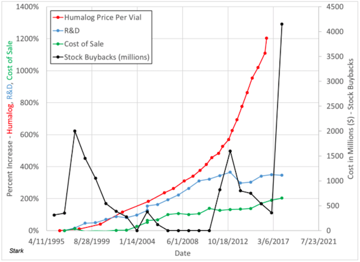

   —

<h4 class="highlight">
  As pharmaceutical companies develop more efficient insulins, without intervention, they will achieve to never make their product completely accessible to 100% of humans that require it to survive.
</h4>

—

  

  <small>Generative art piece "The Insulin Pricing Law" representing my proposal for this "observational law" explaining the global health matter regarding insulin access for insulin dependent human beings. The red and blue objects are the peptide chains A and B required for insulin while distortions represent the difficulties, structural inequalities and fears that people with Type 1 Diabetes face in our lives related to insulin access.</small>

—

<h3 class="text-light pt-3">
  <strong>Why do we need an observational law?</strong>
</h3>

<h4 class="highlight mt-4 mb-4">
  1. This observational law holds up to whatever statement companies have to express about the issue every single time.
</h4>

<h4 class="highlight mt-4 mb-4">
  2. The observational law defines the reality by correctly assigning responsability directly to pharmaceutical companies.
</h4>

<h4 class="highlight mt-4 mb-4">
  3. This law can be used to formally explain the situation every single time they do a public statement regarding insulin pricing and insulin access without solving it.
</h4>

—

<h3 class="text-light pt-3 pb-2">
  <strong>About Insulin</strong>
</h3>

  Insulin is a hormone required by people with Type One Diabetes to survive. Our bodies cannot supply an adequate amount or any at all causing our blood sugar to elevate and become uncontrollable.

  Insulin is composed of two peptide chains: Chain A and Chain B, linked by disulfide bonds. These molecules tend to form dimers and hexamers that cause variations in insulin absorption by our bodies.

  Insulin absorption by our bodies is, in my opoinion, one the most important characteristics of this hormone allowing our bodies to efficiently process the glucose in our bloodstream.

  Modern pharmaceutical companies have developed insulin analogs that are very efficient and solve this requirement for people with Type One Diabetes. 

—

<h3 class="text-light pt-3 pb-2">
  <strong>The issue</strong>
</h3>

  <a href="https://www.t1international.com/" target="_blank">T1 International</a> conducted an online survey of people with type 1 diabetes. It covered out-of-pocket costs associated with type 1 diabetes, insulin rationing, rationing of blood glucose testing supplies, degree of financial coverage and sources of financial support.

  The <a href="https://www.t1international.com/media/assets/file/T1International_Report_-_Costs_and_Rationing_of_Insulin__Diabetes_Supplies_2.pdf">published results</a>, indicate among other things, that:

<h4 class="highlight mt-4 mb-4">
  "Insulin rationing is widespread among people living with type 1 diabetes."
</h4>

  To sum it up, according to the survey, respondents from the United States of America reported the highest percentage of insulin rationing of any high income country surveyed. According to the report: All of this comes as a result of many countries lacking financial support systems for people with type 1 diabetes.

  In my opinion, and that of people rationing insulin, it is due to:

<h4 class="highlight mt-4 mb-4">
  Ridiculous insulin prices that continiously increase.
</h4>

  If people with diabetes can't get their required insulin, the medical consequences include and are not limited to: blindness, kidney failure, limb amputations, and ultimately coma and death.

—

<h3 class="text-light pt-3 pb-2">
  <strong>What do companies say?</strong>
</h3>

  

    

      Well, it all goes around the words of: "We are doing everything possible to make insulin get to every person in need." These heavily corpy-jargoned excuses (🚩) always include words to give the sensation that something will be done soon (🚩🚩) and that these companies are also victims seeking for financial help by governments (🚩🚩🚩) to make insulin available to every person that needs it.
    

    

      A <a href="https://gh.bmj.com/content/3/5/e000850" target="blank">2018 study</a> estimates that the cost of production for a vial of analog insulin goes around USD $3.69 and $6.16 giving us a total cost of insulin per patient per year to around USD $78 - $133
    

    

      According to <a href="https://drive.google.com/file/d/1ehnK2xNO_u2eTlzXykqZtm3j5PU-yCu9/view">this publication</a>, and with data by Andy Kiersz based on data from Truven Health Analytics and published in a <a href="https://www.businessinsider.com/insulin-prices-increased-in-2017-2017-5?r=MX&IR=T">Business Insider article written by Lydia Ramsey in May of 2017</a>, we can see in the next graph the increase in insulin pricing for Eli Lilly's Humalog compared to their R&D and total Cost of Sales over time.
    

  

  

    

       
      <small>Figure 1. Pricing for Humalog vs R&D and Cost of Sales.</small>
    

  

—

<h3 class="text-light pt-3 pb-2">
  <strong>Can I use it on a publication?</strong>
</h3>

  Yes! As long as it is used to positively influence the outcomes of our Type One Diabetes community and correctly give credit. Here are a couple of images you can use on social media to talk about this issue if you wish:

  

    

      
    

  

  

    

      
    

  

  

    

      
    

  

  

    

      
    

  

  Fits in a tweet: 
  The Insulin Pricing Law: As pharmaceutical companies develop more efficient insulins, without intervention, they will achieve to never make their product completely accessible to 100% of humans that require it to survive. #insulin4all

—

