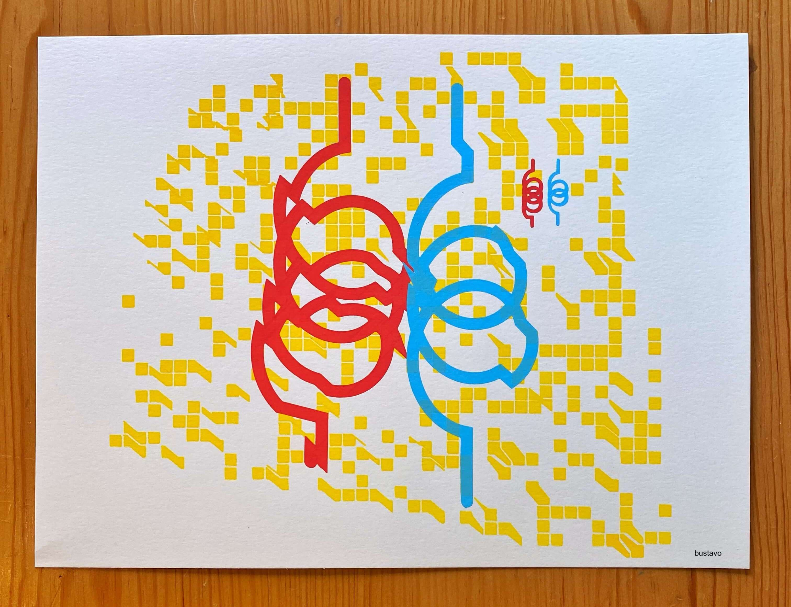

  

  <a href="/insulin-pricing-law" class="btn btn-primary text-dark btn-md btn-block">
    <strong>The Insulin Pricing Law</strong>
  </a>

  &nbsp;

  <a href="https://objkt.com/profile/tz1MLGjH4EGE4MaYWQKQQ4mCrLZAyb3RvAYJ" class="btn btn-dark btn-md btn-block">
    My NFTs on Hic-et-Nunc
  </a>

  <a href="http://buymeacoffee.com/bustavo" class="btn btn-dark btn-md btn-block">
    ☕️ Buy me a coffee ☕️
  </a>

  <a href="/about" class="btn btn-dark btn-md btn-block">
    About Me
  </a>

  <a href="/simpancreas-faq" class="btn btn-dark btn-md btn-block">
    Simpancreas FAQ
  </a>

  &nbsp;

  
  
  
  

